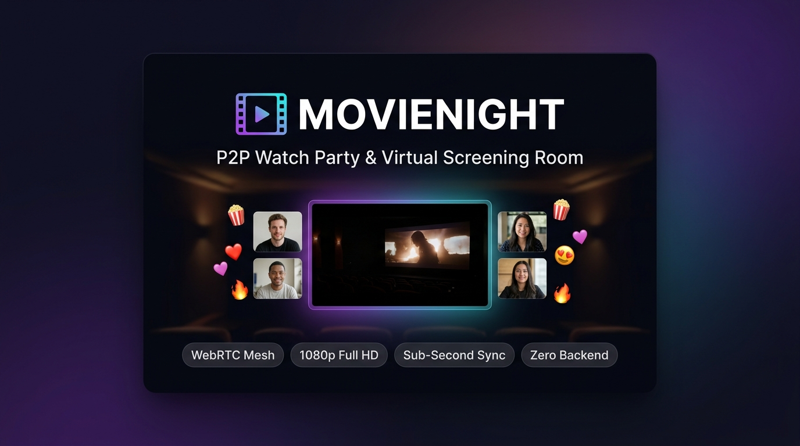

# 🎬 MovieNight — P2P Watch Party & Virtual Screening Room

<div align="center">

[](https://github.com/sagegallant/movienight/releases)
[](LICENSE)
[](https://webrtc.org/)
[](https://peerjs.com/)
[-success?style=for-the-badge)](https://github.com/sagegallant/movienight)
[](https://github.com/sagegallant/movienight/pulls)

<p align="center">
  <strong>Private, peer-to-peer virtual screening room and watch party platform in your browser.</strong><br>
  Stream local video files, direct URLs, screen shares, and synchronized YouTube embeds in near-synchronous lock-step.<br>
  <em>No application database. No central media relay server. Media streams directly between peers over encrypted WebRTC.</em>
</p>

<p align="center">
  
</p>

[**Architecture**](#-architecture--how-it-works) • [**Capabilities**](#-capabilities--specifications) • [**Sync Engine**](#-synchronization-architecture) • [**Connectivity & NAT**](#-connectivity-model--nat-traversal) • [**Security & Threat Model**](#-security-privacy--threat-model) • [**Limitations**](#-known-limitations) • [**Quickstart**](#-quickstart--local-development)

</div>

---

> [!NOTE]
> **Project Status**: MovieNight is an open-source, production-oriented prototype and experimental P2P screening application. It is designed and optimized for small private groups (tested 2–6 participants). An optional lightweight Node.js server component is provided strictly for CORS-restricted media proxying; no media or chat messages are stored on any server.

---

## 🌟 Architectural Highlights

- 🛡️ **No Media Server Architecture**: Video and audio frames are decoded in the browser and transmitted directly to peers using WebRTC DTLS/SRTP encryption. No video files or stream chunks are stored on or relayed through application servers.
- ⚡ **Signaling via PeerJS**: Ephemeral room discovery, ICE candidate exchange, and SDP handshakes are coordinated via PeerJS cloud brokers (or self-hosted PeerServer). Once connected, the signaling server is bypassed for all media and room state.
- 👥 **Optimized for Small Groups (2–6 Peers)**: Designed for private co-watching among friends without the infrastructure cost or complexity of an SFU (Selective Forwarding Unit) or MCU.
- 🎥 **Triple-Mode Playback Pipeline**:
  - **Local Files**: Browser hardware decodes `.mp4`, `.webm`, `.mov`, or `.mkv` files and broadcasts media tracks via `HTMLMediaElement.captureStream()`.
  - **Direct URLs**: HTML5 `<video>` playback with built-in HTTP Range proxy support to handle third-party servers that restrict CORS headers.
  - **YouTube Embeds**: Official YouTube IFrame Player API integration with bidirectional play, pause, and seek synchronization over WebRTC DataChannels.
- 💎 **1080p WebRTC Negotiation Hints**: Injects RFC 4566 SDP bandwidth targets (`b=AS:12000`, `b=TIAS:12000000`, `x-google-start-bitrate=6000`) and encoder directives (`degradationPreference = "maintain-resolution"`, `contentHint = "detail"`) to optimize the browser pipeline for sharp text and 1080p video rather than default low-bitrate webcam tuning.
- ⏱️ **Continuous Drift Correction**: Presenter clock heartbeats and latency compensation maintain near-synchronous playback with an automatic drift-correction threshold ($< 0.8$s).
- 🍿 **Interactive Cinema Stage**: Responsive 16:9 cinema theater, webcam grid, live emoji reactions, Backrow chat, and procedural SVG avatars.

---

## 📊 Capabilities & Specifications

| Dimension | MovieNight Specification | Technical Implementation |
| :--- | :--- | :--- |
| **Network Topology** | Full Mesh (P2P) | Direct peer-to-peer WebRTC connections between all participants |
| **Signaling Dependency** | PeerJS Broker / Cloud | Initial SDP Offer/Answer handshake and ICE candidate exchange |
| **Recommended Group Size** | **2–6 participants** | Mesh upload bandwidth scales linearly ($N-1$ outbound streams per presenter) |
| **Media Server Storage** | **None (0 MB stored)** | Audio/video decoded locally; exists solely in peer browser memory |
| **Application Database** | **None** | Ephemeral room state; rooms dissolve when the last participant departs |
| **Target Video Quality** | Up to 1080p @ 30–60 fps | SDP bandwidth hints (`b=AS:12000`); bounded by client CPU and upload bandwidth |
| **Target Audio Quality** | Up to 256 kbps Stereo | RFC 7587 Stereo Opus negotiation (`stereo=1; maxaveragebitrate=256000`) |
| **Sync Accuracy Target** | Near-sync (drift $< 0.8$s) | 1000ms periodic heartbeat + network transit offset compensation |
| **Transport Separation** | SRTP (Media) + SCTP (Control) | Dedicated media tracks for video/audio; DataChannels for chat and sync |
| **Access Control** | Knock & Approval Admission | 6-character room codes (`ABC-123`) with host-approved entry modal |
| **CORS Media Proxy** | Optional Node.js Service | HTTP Range forwarder (`/proxy-video`) for external media URLs lacking CORS |

---

## 🏗️ Architecture & How It Works

### 1. Connection & Transport Separation

MovieNight strictly separates media streaming from control signaling:
- **Media Plane (SRTP)**: Real-time audio and video tracks flow directly between peer browsers over encrypted DTLS-SRTP.
- **Control Plane (SCTP DataChannel)**: Room events, chat messages, emoji reactions, and playback heartbeats flow across bidirectional WebRTC DataChannels.

```
                         +-----------------------------+
                         |    PeerJS Cloud / Broker    |
                         |  (Signaling & ICE Discovery)|
                         +--------------+--------------+
                                        |
              Room Connection Request   |   SDP Offer / Answer & ICE
              (Knock & Approval)        |   (Target 12 Mbps SDP Hints)
                                        v
         +-------------------------------------------------------------+
         |                                                             |
         v                                                             v
+--------+-------------+                                     +---------+-----------+
|    PRESENTER / HOST  |                                     |    PARTICIPANT 1    |
|                      |             WebRTC P2P Mesh         |                     |
|  - video element     |====================================>|  - remote <video>   |
|  - captureStream()   |       SRTP: Video & Opus Audio      |  - Drift Corrector  |
|  - Clock Authority   |------------------------------------>|  - Chat & Reactions |
+--------+-------------+        SCTP: DataChannel Sync       +---------+-----------+
         |                                                             ^
         |                    WebRTC P2P Mesh                          |
         +=============================================================+
         |
         v
+--------+-------------+
|    PARTICIPANT 2     |
|                      |
|  - Webcams & Mics    |
|  - Backrow Chat      |
+----------------------+
```

### 2. Video Stream Quality Optimization Pipeline

WebRTC was originally designed for low-bandwidth video calling, defaulting to conservative bitrates (300 kbps) and dropping resolution under CPU or network load. MovieNight optimizes this pipeline:

```
[Local Video / Web URL / YouTube]
               │
               ▼
 [Native HTML5 Video Element]
               │
               ├─► video.captureStream() ──► track.contentHint = "detail"
               │
               ├─► Native Decoded Stereo Audio (48 kHz)
               │
               ▼
 [PeerConnection setLocalDescription]
               │
               ├─► SDP Munge: b=AS:12000 / b=TIAS:12000000 (12 Mbps ceiling hint)
               ├─► SDP Munge: x-google-start-bitrate=6000 (Instant HD fast ramp)
               ├─► SDP Munge: stereo=1; sprop-stereo=1; maxaveragebitrate=256000
               │
               ▼
[Sender degradationPreference: "maintain-resolution"]
               │
               ▼
[Encrypted SRTP Mesh Delivery (Target 1080p @ 30-60 fps)]
```

*Note: SDP attributes serve as negotiation hints. Final delivered bitrate and frame rate adapt dynamically via WebRTC's congestion control algorithms based on available peer-to-peer network capacity and client hardware limits.*

---

## ⏱️ Synchronization Architecture

MovieNight achieves near-synchronized playback across different network connections without a central media server using an authoritative client clock with transit compensation.

```
PRESENTER                                                   PARTICIPANT
    │                                                            │
    │ ─── 1. Emits Heartbeat (T = 1.0s) ───────────────────────► │
    │     { currentTime: 142.5, paused: false, timestamp: t0 }   │
    │                                                            │
    │                                                            │ ─── 2. Computes Transit Latency:
    │                                                            │        Δt = (Date.now() - t0) / 1000
    │                                                            │
    │                                                            │ ─── 3. Computes Target Position:
    │                                                            │        targetTime = currentTime + Δt
    │                                                            │
    │                                                            │ ─── 4. Evaluates Drift:
    │                                                            │        drift = |localTime - targetTime|
    │                                                            │        • If drift > 0.8s: seekTo(targetTime)
    │                                                            │        • If drift ≤ 0.8s: ignore (prevent stutter)
    │                                                            │
    │ ◄── 5. Host Override (Pause / Seek / Play) ─────────────── │
```

### Protocol Steps:
1. **Heartbeat Beacon**: The active presenter broadcasts a sync payload every 1000ms over the DataChannel:
   $$\{ \text{currentTime}, \text{duration}, \text{paused}, \text{timestamp: Date.now()} \}$$
2. **Transit Latency Estimation**: The participant calculates one-way transit delay:
   $$\Delta t = \frac{\text{Date.now()} - \text{timestamp}}{1000}$$
3. **Expected Position Calculation**:
   $$\text{targetTime} = \text{currentTime} + (\text{paused} ? 0 : \Delta t)$$
4. **Drift Evaluation**:
   $$\text{drift} = |\text{localPlaybackTime} - \text{targetTime}|$$
   - **Threshold breached ($\text{drift} > 0.8\text{s}$)**: The participant smoothly seeks to `targetTime`.
   - **Within tolerance ($\text{drift} \le 0.8\text{s}$)**: Normal playback continues uninterrupted, avoiding micro-stutters.
5. **Late-Joiner Recovery**: When a new viewer joins mid-screening, they receive the room's current state and apply $\Delta t$ to jump immediately to the current playback position.
6. **Host Override Authority**: If the room host is not the presenter, host playback actions (play, pause, seek) broadcast high-priority control packets that override local client states.

---

## 🌐 Connectivity Model & NAT Traversal

MovieNight relies on WebRTC's Interactive Connectivity Establishment (ICE) protocol:

- **STUN Discovery**: Uses public Google STUN servers (`stun:stun.l.google.com:19302`) to discover external public IP addresses and UDP port mappings.
- **NAT Traversal Capability**: Successfully establishes direct peer-to-peer connections across Full-Cone NAT, Address-Restricted NAT, and Port-Restricted NAT configurations (standard for most home broadband and consumer Wi-Fi networks).
- **Symmetric NAT & Enterprise Firewalls**: When two connecting peers are both behind symmetric NATs (common in corporate, university, or strict cellular networks), direct UDP socket pairs cannot be negotiated using STUN alone. In such environments, a **TURN relay server** (RFC 5766) is required. Users deploying in enterprise environments can configure custom TURN credentials in the PeerJS connection options.

---

## 📱 Browser Compatibility Matrix

| Feature | Chrome / Edge (v90+) | Firefox (v95+) | Safari macOS (v15+) | Mobile Safari / Chrome |
| :--- | :---: | :---: | :---: | :---: |
| **Local File Streaming** | ✅ Full Support | ✅ Full Support | ⚠️ Supported (H.264/AAC) | ❌ Restricted (File picker/upload limitations) |
| **Direct URL Streaming** | ✅ Full Support | ✅ Full Support | ✅ Full Support | ⚠️ View only (Autoplay restrictions) |
| **YouTube Embed Sync** | ✅ Full Support | ✅ Full Support | ✅ Full Support | ⚠️ View only (Requires initial tap to unmute) |
| **Screen / Tab Sharing** | ✅ Full Support | ✅ Full Support | ⚠️ Screen only | ❌ OS Restricted |
| **Webcam & Mic Mesh** | ✅ Full Support | ✅ Full Support | ✅ Full Support | ⚠️ Single active camera stream |
| **SDP Bandwidth Munging**| ✅ Full Support | ⚠️ Partial (RFC 4566) | ⚠️ Partial | ⚠️ Standard WebRTC defaults |

---

## 🔒 Security, Privacy & Threat Model

### Security Architecture
- **In-Transit Encryption**: All peer-to-peer audio, video, and DataChannel payloads are encrypted end-to-end using browser-enforced **DTLS** (Datagram Transport Layer Security) and **SRTP** (Secure Real-time Transport Protocol).
- **Ephemeral In-Memory Operation**: MovieNight operates with zero database persistence. Room codes, participant lists, and chat messages exist solely in the browser memory of active participants and vanish when the room closes.
- **Admission Control**: Private screening rooms require the host to explicitly approve each participant via a Knock-and-Approval modal.

### Threat Model & Mitigations

| Threat Vector | Risk Level | Mitigation Strategy |
| :--- | :---: | :--- |
| **Room Code Guessing / Brute Force** | Medium | Rooms use random 6-character alphanumeric codes. Even if guessed, the host must manually admit the participant via the admission modal. |
| **Malicious External Video URLs** | Low/Medium | Video URLs are loaded into standard HTML5 `<video>` elements or sandboxed YouTube `<iframe>` elements. No user-supplied scripts are evaluated. |
| **Signaling Broker Metadata** | Low | The public PeerJS signaling server observes connection metadata (IP addresses, peer IDs) during handshake. For total network autonomy, self-host [PeerServer](https://github.com/peers/peerjs-server). |
| **CORS Proxy Abuse** | Low/Medium | The Node.js `/proxy-video` endpoint validates URL protocols (`http:`, `https:`), enforces a maximum of 5 redirects, and only proxies binary media streams. It is not an open general-purpose proxy. |

> [!WARNING]
> **Proxy Scope Notice**: The included Node.js `/proxy-video` proxy forwards HTTP Range requests with CORS headers to enable video capture. It is a streaming forwarder, **not** an antivirus, deep-packet-inspection, or content-sanitization firewall. Do not paste untrusted URLs from unknown sources.

---

## ⚠️ Known Limitations

1. **P2P Mesh Bandwidth Scaling**: Because MovieNight uses a peer-to-peer mesh rather than an SFU relay, the presenter's computer must upload separate video streams to every viewer ($N-1$ outbound streams). A 1080p stream at 6 Mbps with 4 viewers requires $\approx 24$ Mbps upload bandwidth. For this reason, MovieNight is designed for small groups (2–6 users).
2. **Codec Compatibility**: Local file playback relies on native browser decoder support. Standard `.mp4` (H.264 / AAC) and `.webm` (VP8/VP9 / Opus) work seamlessly across all platforms. Proprietary formats such as HEVC/H.265 or Dolby DTS audio may not decode in browsers lacking hardware licenses.
3. **Autoplay Policies**: Modern browsers prohibit media from playing with sound automatically without prior user interaction. Remote YouTube embeds and direct streams start muted by default; viewers must click once to enable audio.
4. **Mobile Background Throttling**: Mobile operating systems (iOS and Android) pause WebRTC video processing and camera tracks when the browser tab is sent to the background.

---

## 💻 Quickstart & Local Development

### Prerequisites
- [Node.js](https://nodejs.org/) 18+ (or any static HTTP server)
- Modern web browser with WebRTC support

### 1. Clone & Install
```bash
git clone https://github.com/sagegallant/movienight.git
cd movienight
npm install
```

### 2. Start the Application
```bash
npm start
```
The server will start at `http://localhost:3000`.

### 3. Usage
1. Open `http://localhost:3000` in your browser.
2. Enter your display name, choose an avatar, and click **START A NEW SCREENING**.
3. Share the room code (`ABC-123`) or direct link (`http://localhost:3000/?room=ABC123`) with a friend.
4. When your friend joins, click **Admit** on the host modal.
5. Click **STREAM A VIDEO** to drop a local movie or paste a direct media URL!

---

## 🌐 Deployment Options

### Option A: GitHub Pages (Zero Server Costs)
MovieNight can run purely client-side on GitHub Pages. The repository includes an automated GitHub Actions deployment workflow ([`.github/workflows/deploy.yml`](.github/workflows/deploy.yml)):

1. Fork this repository.
2. Navigate to **Settings > Pages**.
3. Under **Build and deployment > Source**, select **GitHub Actions**.
4. Push to `main` to trigger the deployment.

*Note: GitHub Pages deployment operates without the Node.js CORS proxy. Local video files, synchronized YouTube embeds, and CORS-enabled CDN links work seamlessly.*

### Option B: Self-Hosted Node.js VPS (With CORS Proxy)
To enable streaming of external video URLs whose origin servers block CORS:

```bash
# Production setup with PM2
npm install -g pm2
pm2 start server.js --name "movienight"
pm2 startup
pm2 save
```

---

## ⌨️ Keyboard Shortcuts

| Key | Action |
| :---: | :--- |
| <kbd>Space</kbd> / <kbd>K</kbd> | Toggle Play / Pause |
| <kbd>F</kbd> | Toggle Fullscreen Cinema Mode |
| <kbd>M</kbd> | Toggle Video Mute / Unmute |
| <kbd>C</kbd> | Toggle Backrow Chat Sidebar |
| <kbd>→</kbd> | Seek forward 10 seconds |
| <kbd>←</kbd> | Seek backward 10 seconds |
| <kbd>Esc</kbd> | Close modals / Exit fullscreen |

---

## 🛠️ Technology Stack

- **Core**: Vanilla ECMAScript (ES6+), HTML5 Semantic Markup, Modern CSS3
- **Networking**: [WebRTC](https://webrtc.org/) (Real-Time Communication) & [PeerJS](https://peerjs.com/)
- **Media Engine**: HTML5 Media CaptureStream API, Web Audio API, RFC 4566 SDP Munging
- **Player Sync**: YouTube IFrame Player API with bidirectional DataChannel message synchronization
- **CORS Proxy**: Node.js `http`/`https` streaming pipelines with HTTP Range request forwarding
- **Icons & Visuals**: Font Awesome 6, Procedural generative SVG avatars

---

## 📄 Changelog & Versioning

MovieNight adheres to [Semantic Versioning](https://semver.org/). See the complete version history in [CHANGELOG.md](CHANGELOG.md).

---

## 🤝 Contributing

Contributions are welcome! Whether filing bug reports, improving documentation, or optimizing the WebRTC sync engine:

1. Fork the Project.
2. Create your Feature Branch (`git checkout -b feature/AmazingFeature`).
3. Commit your Changes (`git commit -m 'feat: Add AmazingFeature'`).
4. Push to the Branch (`git push origin feature/AmazingFeature`).
5. Open a Pull Request using our [PR Template](.github/pull_request_template.md).

---

## 📄 License

Distributed under the **MIT License**. See [`LICENSE`](LICENSE) for details.

---

<div align="center">
  <sub>Built with ❤️ for movie lovers and privacy enthusiasts. If you find MovieNight helpful, please give it a ⭐ on GitHub!</sub>
</div>
